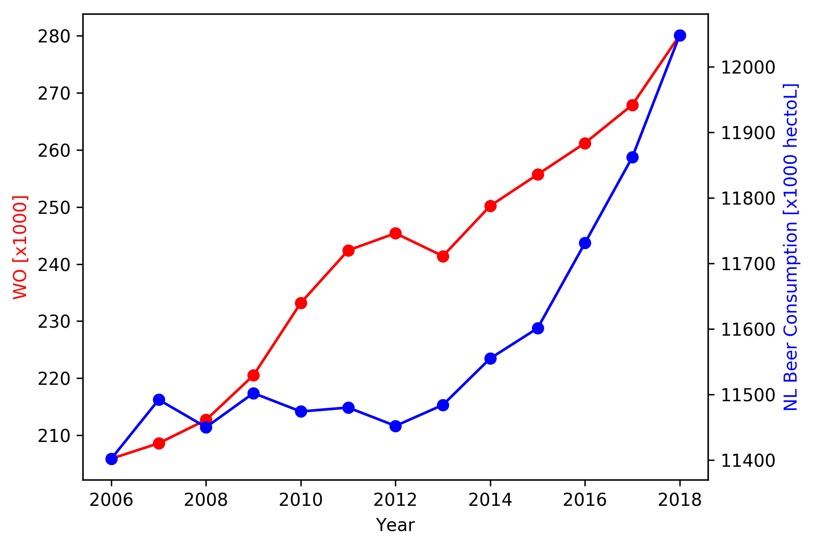

MCC Van Dyke et al., 2019: Fantastic yeasts and where to find them: the hidden diversity of dimorphic fungal pathogens \
JT Harvey, Applied Ergonomics, 2002: An analysis of the forces required to drag sheep over various surfaces \
DW Ziegler et al., 2005: The neurocognitive effects of alcohol on adolescents and college students

StudentID: 13490043 \
Name: Louise Pos

I've decided to create a plot with 2 different y-axis in one single plot, as the values for both variables were too far away from each other to plot all together.
You can see that in general the lines show some similarity as they share some equality in how steep they are.
However, they do not show enough resemblence to say that there is correlation between the two.
In fact, the lines sometimes go opposites directions.

